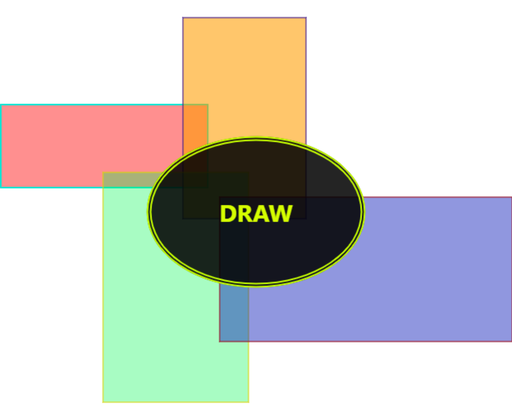

# Draw

# Getting Started with Create React App

This project was bootstrapped with [Create React App](https://github.com/facebook/create-react-app).

# Learn More

You can learn more in the [Create React App documentation](https://facebook.github.io/create-react-app/docs/getting-started).

To learn React, check out the [React documentation](https://reactjs.org/).

# Try It

[ccprojects.altervista.org/app/draw](https://ccprojects.altervista.org/app/draw/)

# Install

`yarn install`

# Usage

`yarn start`

# Motivation

The purpose of this project was to get familiar with React.
